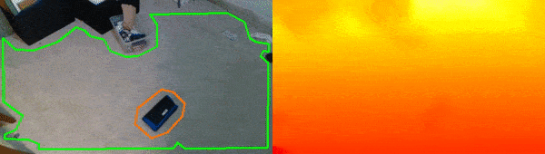

# Polylidar with Intel RealSense Example - Ground/Obstacle Detection

This repository contains code and examples for integrating [Polylidar](https://github.com/JeremyBYU/polylidarv2) with an Intel RealSense camera.  The example presented is for ground/obstacle detection with representation as polygons. To learn more about Polylidar and its use cases for concave polygons extraction see it's [repository](https://github.com/JeremyBYU/polylidar).



The main components of the code are as follows:

1. Using `pyrealsense2` to interface with the a D435 sensor.
2. Apply filtering to generated depth images (spatial,temporal, etc.).  
3. Generate a point cloud from filtered depth image.
4. Find ground normal and rotate point cloud to align its z-axis with ground normal.
5. Use `polylidar` to extract flat surfaces and obstacles as polygons
6. Perform polygon filtering and buffering.
7. Project polygons onto image for display and verification

Please see disclaimers below before using Polylidar with an Intel RealSense camera for your application.

## Installation

1. Install [conda](https://conda.io/projects/conda/en/latest/) - [Why?](https://medium.freecodecamp.org/why-you-need-python-environments-and-how-to-manage-them-with-conda-85f155f4353c)
2. `conda create --name realsense python=3.6 && source activate realsense` - Create new virtual python environment
3. `git clone --recurse-submodules https://github.com/JeremyBYU/polylidar-realsense.git && cd polylidar-realsense`
4. `conda install -c conda-forge opencv shapely` - These packages give the most issue for binary dependencies for Windows users, hence why conda should handle them.
5. `cd thirdparty/polylidar && pip install -e . && cd ../..` - Install polylidar manually because it is not on PyPi.
6. `pip install -e .` - Install any dependencies for this repository (groundetector).

## Running

The demo code is in `capture.py` and be called as so `python surfacedetector/capture.py`.  All parameters used to configure the intel RealSense camera can be found in `surfacedetector/config/default.yaml`. You can specify alternate configuration profiles as a command line parameter. Note that the image generated above used `tilted.yaml` configuration file. 

```txt
usage: capture.py [-h] [-c CONFIG] [-v VIDEO]

Captures ground plane and obstacles as polygons

optional arguments:
  -h, --help            show this help message and exit
  -c CONFIG, --config CONFIG
                        Configuration file
  -v VIDEO, --video VIDEO
                        Video file path
```

### T265

If you have a T265 that is rigidly mounted with your D4XX, we can skip the floor normal calculation and just rotate the point cloud into the world frame using T265 Pose data. Use the script `python surfacedetector/tracking.py` for this work.

## Disclaimers

The Intel D435 is very noisy with dense point clouds. The only way to make it usable for Polylidar (as it is currently implemented) is to use heavy filtering, including temporal filtering. Also the points are downsampled in order to:

1. Increase runtime speed. Less points = faster polylidar performance.
2. Create more gaps between points which increases triangle average size. The true planarity (normal) of a triangle is more apparent the larger the triangle is in relation to sensor noise.

Imagine a ground triangle with 1cm edge lengths with a height noise of 1 cm. The noise dominates the triangle and makes the normal of the triangle not planar. Now image 5 cm edge lengths with same 1cm height noise. The noise makes less of a difference and it appears to be more flat.

Note this repository uses a very simple method for determining the ground normal. It simply looks at the bottom portion of the depth image and does a best plane fit. In production, one should use RANSAC or other robust plane fitting algorithms for ground normal determination. Ground normal determination is not the focus of this repo.
