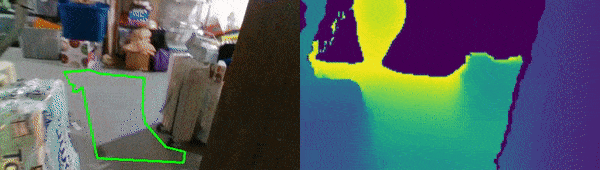
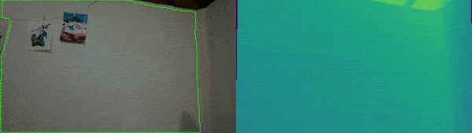

# Polylidar3D with Intel RealSense RGBD Camera

This repository contains code and examples for integrating [Polylidar3D](https://github.com/JeremyBYU/polylidar) with an Intel RealSense camera.  The example presented is for flat surface/obstacle detection with representation as polygons. To learn more about Polylidar3D and its use cases for concave polygons extraction see it's [repository](https://github.com/JeremyBYU/polylidar).

Using RealSense D435i



Using RealSense L515 (New!)



The main components of the code are as follows:

1. Using `pyrealsense2` to interface with the a D4XX sensor.
2. Apply filtering to generated depth images (spatial,temporal, etc.). 
3. Use [Polylidar3D](https://github.com/JeremyBYU/polylidar) to extract Polygons.
    1. Depth image to *organized* point cloud.
    2. Laplacian and Bilateral mesh smoothing. Optional GPU acceleration. [OPF](https://github.com/JeremyBYU/OrganizedPointFilters)
    3. Dominant Plane Normal Estimation [FastGA](https://github.com/JeremyBYU/FastGaussianAccumulator). 
    4. Plane/Polygon Extraction
4. Perform polygon filtering and buffering.
5. Project polygons onto image for display and verification

Please see disclaimers below before using `Polylidar3D` with an Intel RealSense camera for your application.

## Installation

Please begin with first installing a python virtual environment.

1. Install [conda](https://conda.io/projects/conda/en/latest/) - [Why?](https://medium.freecodecamp.org/why-you-need-python-environments-and-how-to-manage-them-with-conda-85f155f4353c)
2. `conda create --name realsense python=3.6 && source activate realsense` - Create new virtual python environment

There are three main dependencies which must be installed. Please `git clone` each of these repositories in separate directories in your workspace. You will need CMake to build each of these repositories. Please note each repo's installation section about building and *installing* `python` bindings. Please be sure that you have activated your newly created virtual environment when building these repositories (`realsense`).

1. [Polylidar3D](https://github.com/JeremyBYU/polylidar)
2. [OPF](https://github.com/JeremyBYU/OrganizedPointFilters)
3. [FastGA](https://github.com/JeremyBYU/FastGaussianAccumulator)

Once that is all done just install any dependencies needed in this repo.

1. `conda install -c conda-forge opencv shapely` - These packages give the most issue for binary dependencies for Windows users, hence why conda should handle them.
2. `pip install -e .` - Install any dependencies for this repository (`surfacedetector`).


## Running

The demo code is in `capture.py` and be called as so `python -m surfacedetector.capture`.  All parameters used to configure the module can be found in `surfacedetector/config/default.yaml`. You can specify alternate configuration profiles as a command line parameter.

```txt
(ppb) ➜  polylidar-realsense git:(polylidar3d) ✗ python -m surfacedetector.capture --help
usage: capture.py [-h] [-c CONFIG] [-v VIDEO]

Captures ground plane and obstacles as polygons

optional arguments:
  -h, --help            show this help message and exit
  -c CONFIG, --config CONFIG
                        Configuration file
  -v VIDEO, --video VIDEO
                        Video file save path
```

## Sample Files

You can download two (2) [bag](https://github.com/IntelRealSense/librealsense/blob/master/doc/sample-data.md) files that were recorded inside my residence with a D435i. Playback can be enabled through the `default.yaml` file. The first bag file is of my basement, while the second bag file is of my main floor.  Please note that the lighting is controlled in these environments leading to less noise for an Intel RealSense Camera. When these camera's are used outside....lets just say the depth maps are "very poor". This in turn leads to degraded results for Polylidar3D as well. LiDAR always works better : ) .  

Here are the bag files (each one is about 1 GB!): [basement bag file](https://drive.google.com/file/d/1q-6qP1zMuA7MklzGJPFFZeWAt2O5waQC/view?usp=sharing), [main floor bag file](https://drive.google.com/file/d/1NFGjEqpiGv-W_AddVe17FaLmkWiXv4Ik/view?usp=sharing)

Here are the generated videos in their entirety: [basement video](https://drive.google.com/file/d/1nmJEqWAchZxdVYrKxWLh5OsbA0dk7WmF/view?usp=sharing), [main floor video](https://drive.google.com/file/d/1l4yuMLjyRt7Hzkp0V8bhcblg_bVHj4NW/view?usp=sharing)

## Helpful Notes

Here is an issue that discussed some ways to help improve polygon extraciton: [Issue](https://github.com/JeremyBYU/polylidar-realsense/issues/4)

## Disclaimers

The Intel D435 is very noisy with dense point clouds. The only way to make it usable for `Polylidar3D` (as it is currently implemented) is to use heavy filtering, including temporal filtering. Also the points are downsampled in order to:

1. Increase runtime speed. Less points = faster polylidar performance.
2. Create more gaps between points which increases triangle average size. The true planarity (normal) of a triangle is more apparent the larger the triangle is in relation to sensor noise.

Imagine a ground triangle with 1cm edge lengths with a height noise of 1 cm. The noise dominates the triangle and makes the normal of the triangle not planar. Now image 5 cm edge lengths with same 1cm height noise. The noise makes less of a difference and it appears to be more flat.

## Notes on L515

Uses solid state lidar technology.

1. Does *not* work in sunlight!
2. Very precise (low noise) and accurate in indoor areas with no sunlight.
3. Does not work well on matte black items.
4. Brand new sensor with a few bugs and issues.
5. Does not work well on angled surfaces. In other words it works best on flat surface directly in front of it.

